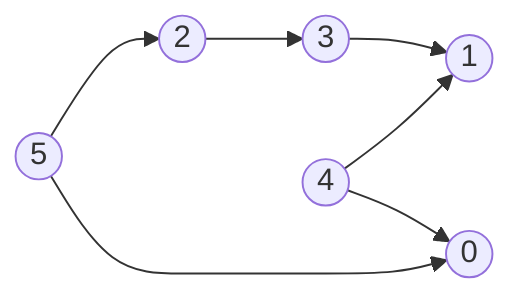
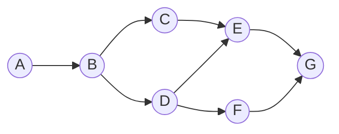

# Algorithms and Data Structures - Kahn

The Kahn's algorithm is a method for **topological sorting** of a **directed acyclic graph (DAG)**. It works by iteratively removing nodes with no incoming edges and adding them to the sorted order. The process continues until all nodes are removed or a cycle is detected.

## Characteristics
- Time complexity: O(V + E)
  - V = number of vertices
  - E = number of edges
- Space complexity: O(V + E)

## Demos

### Using Numbered Vertices

[Implementation](./src/01-kahn-using-numbered-vertices.py)

### Using Labelled Vertices

[Implementation](./src/02-kahn-using-labelled-vertices.py)

## References
- [Other Algorithms & Data Structures](https://github.com/NelsonBN/algorithms-data-structures)
