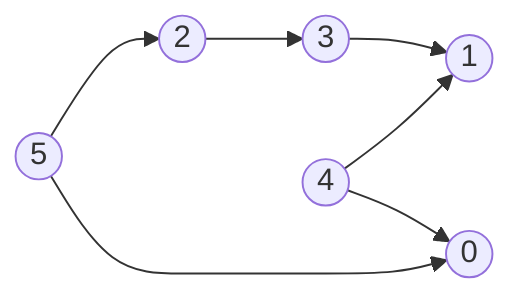
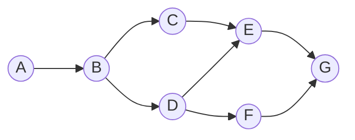
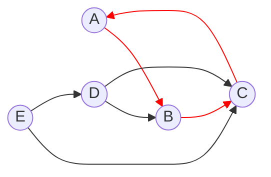
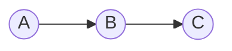
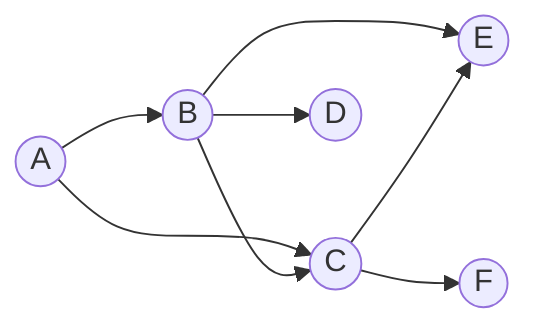

# Algorithms and Data Structures - Kahn

The Kahn's algorithm is a method for **topological sorting** of a **directed acyclic graph (DAG)**. It works by iteratively removing nodes with no incoming edges and adding them to the sorted order. The process continues until all nodes are removed or a cycle is detected.

## Characteristics
- Time complexity: O(V + E) - Because the algorithm processes each vertex and edge exactly once.
  - V = number of vertices
  - E = number of edges
- Space complexity: O(V) - The algorithm use a list to store the in-degree of each vertex and a queue to store the vertices with in-degree 0.

## Demos

### Using Numbered Vertices

[Implementation](./src/01-kahn-using-numbered-vertices.py)

### Using Labelled Vertices

**DAG**:

**Cycle**:

[Implementation](./src/02-kahn-using-labelled-vertices.py)

### Detect if has more than one topological sorting

[Implementation](./src/03-kahn-detecting-multiple-topological-sorting.py)

## References
- [Topological Sorting with DFS](https://github.com/NelsonBN/algorithms-data-structures-topological-sorting-dfs)
- [Other Algorithms & Data Structures](https://github.com/NelsonBN/algorithms-data-structures)
